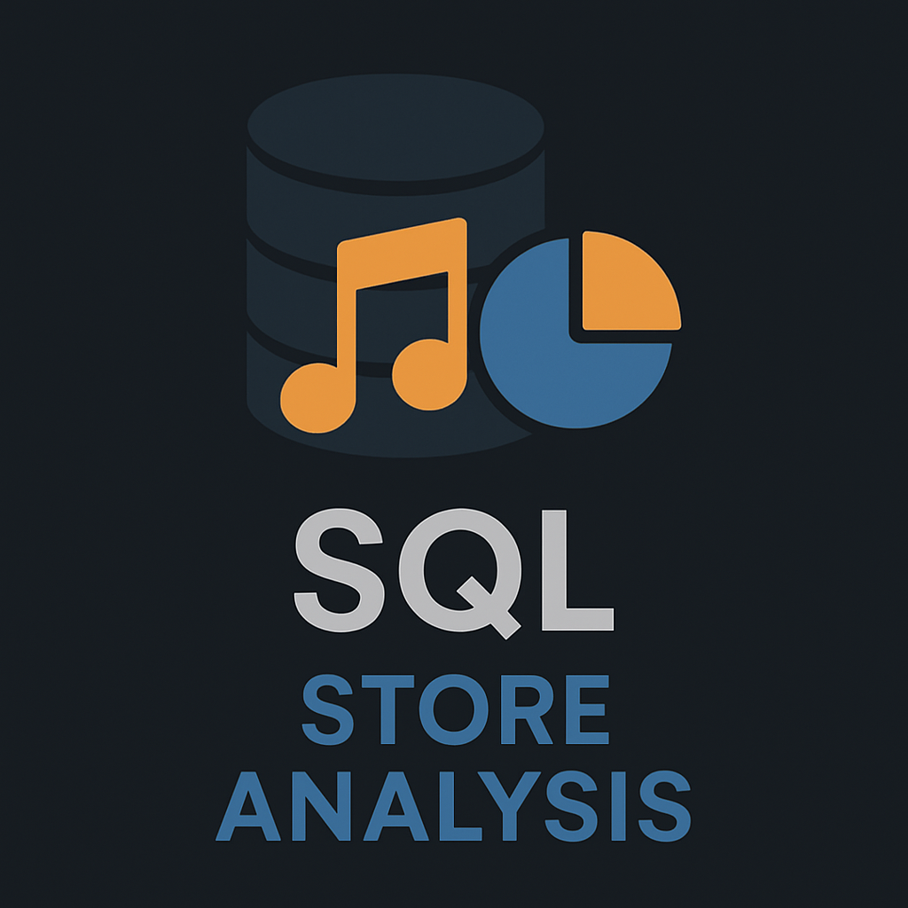

   
    
   

  <h3 align="center">A SQL BASED PROJECT</h3> 

🎵 SQL Store Analysis

The SQL Store Analysis project is a data-driven exploration and reporting system designed to uncover insights from a digital store's relational database. This project leverages SQL to query structured data, identify sales patterns, understand customer behavior, and assist in business decision-making. It demonstrates strong skills in database management, complex querying, and data analysis, ideal for showcasing practical knowledge in SQL and data interpretation.

📌 Project Overview

The project focuses on analyzing a typical music store database, which contains tables for customers, invoices, invoice lines, tracks, artists, albums, genres, employees, and more. The main goal is to generate meaningful business insights through structured queries—providing a comprehensive understanding of sales trends, popular music genres, customer demographics, employee performance, and revenue streams.

🛠️ Tech Stack

Database System:

MySQL / SQLite – Relational database containing preloaded music store data

Query Language:

SQL – Used to extract, filter, aggregate, and analyze data

Tools for Visualization (Optional Enhancements):

Power BI or Excel – For creating charts, dashboards

Python (pandas, matplotlib) – For extending analysis with data processing and visuals

📊 Key Analysis Areas

🎧 Top-Selling Tracks & Genres

Most purchased tracks and albums

Top genres by number of sales and revenue

🛒 Sales Performance

Total sales by country, city, or customer

Revenue trends over time (monthly/quarterly/yearly)

📍 Customer Insights

Active vs inactive customers

Geographical distribution of customers

Highest-paying customers

📀 Artist & Album Analysis

Most streamed or purchased artists

Albums generating the most revenue

🧑‍💼 Employee Performance

Sales generated by each sales representative

Territories with the highest performance

📈 KPIs & Metrics

Average invoice value

Repeat customer rate

Genre preference by region or demographic

## Database and Tools
* Postgre SQL
* PgAdmin4

Follow me on LinkedIn : 

Follow me on Kaggle : 

Follow me on Instagram : 

Follow me on Github : 

